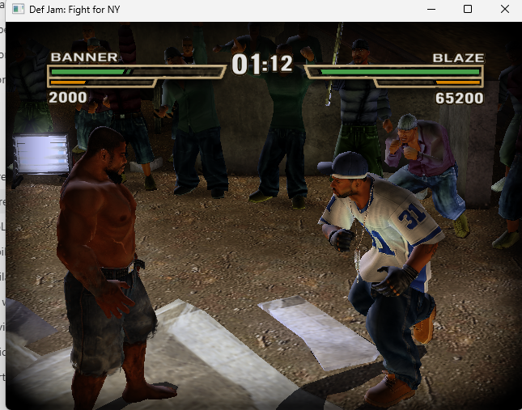
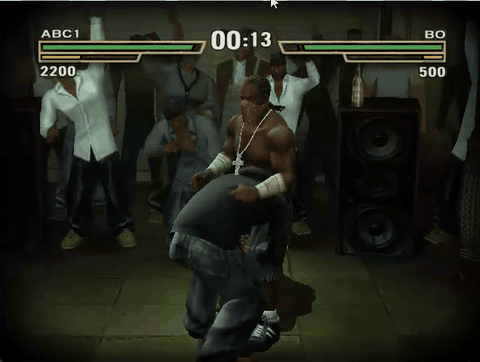

# Def Jam: Fight for NY — Recompiled

[](https://github.com/vyanhursky/DefJamFFNY-recomp/actions/workflows/ci.yml)
[](https://github.com/vyanhursky/DefJamFFNY-recomp/releases)
[](LICENSE)

A native Windows port of **Def Jam: Fight for NY**, built from the original
Xbox version with [xboxrecomp](https://github.com/sp00nznet/xboxrecomp).
The Xbox executable is translated into C and compiled ahead of time. Its own
gameplay, menus and cutscenes run on an Xbox compatibility runtime, with graphics
rendered through Direct3D 11 and audio and controller input supplied by the host.

**The Windows build is playable and FUN.** Menus, Story routes and fights render
and run. The maintainer's October 4, 2026 playtest reported smooth frames, much
better audio, and no additional graphical glitches discovered over one hour
of Story Mode playtime. This is an early release, with more PC features and
platform work still ahead.

You need your **own supported Xbox game dump** and must build the game locally.
The public source package contains maintained port code, tooling and documentation.
Game assets, disc images, generated game source and the compiled game executable
are not distributed.

[Build and play](docs/build-and-play.md) · [Documentation](docs/README.md) ·
[Known issues](docs/known-issues.md) · [Contributing](CONTRIBUTING.md) ·
[Releases](https://github.com/vyanhursky/DefJamFFNY-recomp/releases)

## Gameplay





Gameplay captured by the maintainer. The GIF is a short, silent preview.

## Current status

| Area | Status |
|---|---|
| Windows x64 | Playable; tested on Windows 11 |
| Menus and fights | Navigation, match setup, controllable fights and returning to menus verified |
| Story | Intro/cutscenes, character creator, saved-profile crib and gym routes verified |
| Graphics | GPU vertex programs and Direct3D 11 rendering; 2× render scale available |
| Audio | Music, speech and effects; owner listening test accepted |
| Launcher and overlay | A start-up window and an in-game overlay (F1) for display, controller and key settings, usable with mouse, keyboard or pad; see [Launcher and overlay](docs/launcher-and-overlay.md) |
| Input | Gamepads (Xbox, DualSense, Switch Pro and most others), keyboard and mouse as a player of their own, rumble and remapping; see [Controllers, keyboard and mouse](docs/10-input.md) |
| Saves | Local profiles, with compatibility for earlier project builds |
| Steam Deck / Proton | Planned after PC features; not yet validated |
| macOS / native Linux | Future roadmap; not yet supported |

The latest rebase passed the full nine-check game regression on Debug and Release,
a 20-boot Debug soak, and five additional capture routes. These tests do not cover
every mode or a full Story playthrough. See [validation evidence](docs/research/toolkit-rebase-acceptance.md)
and [known issues](docs/known-issues.md).

## Getting started

You need Windows x64, Git, Python, Visual Studio C++ Build Tools, a Direct3D 11
GPU and a gamepad or a keyboard. Only the **USA Xbox version** matching the
[dump manifest](config/dump-manifest.json) is supported. PS2 and GameCube copies
cannot be used as build inputs.

```powershell
git clone --recursive https://github.com/vyanhursky/DefJamFFNY-recomp.git
cd DefJamFFNY-recomp
```

Follow the [build-and-play guide](docs/build-and-play.md) to choose a data folder,
extract and verify your disc, then analyze, recompile and build:

```powershell
.\scripts\analyze.ps1
.\scripts\recomp.ps1
.\scripts\build.ps1 -Preset win-x64-release
.\scripts\run.ps1 -Preset win-x64-release
```

The first build produces the game executable on your machine. The Release preset
is optimized `RelWithDebInfo`: symbols are retained for crash diagnosis.
The executable enables graphics, display timing and input support automatically. It opens a
launcher window first (settings and a Play button; it can be skipped) and the settings are also
available in the game with F1: see [Launcher and overlay](docs/launcher-and-overlay.md).

GitHub's source ZIP omits the toolkit submodule. A recursive Git clone is the
supported setup path; release notes give the command for the exact version.
There is no prebuilt player package in this release.

## What comes next

PC features are in progress, one release at a time: display settings, a settings file,
gamepads and keyboard play, a launcher and an in-game settings overlay are in; true 16:9 and
texture packs follow. Steam Deck via Proton follows, then macOS. Native Linux
and deeper gameplay decompilation remain stretch goals. See the
[roadmap](docs/01-plan-review.md#corrected-roadmap-milestones-with-exit-criteria)
and [development status](PROGRESS.md).

## Reporting problems

Open an [issue](https://github.com/vyanhursky/DefJamFFNY-recomp/issues) with your
version/commit, Windows version, CPU/GPU, controller, reproduction steps and
expected versus observed behavior. Relevant lines from `logs/run-*.log.err`
help identify a failure; review personal paths before sharing. Do not attach
game data, generated source, saves or memory dumps.

## Credits and licensing

Maintained by **vyanhursky**, with development assistance from Claude Code
and Codex. The port builds on **sp00nz's xboxrecomp** and work from the Xbox
emulation community. xemu provides hardware references and attributed components
in the toolkit. [Burnout 3](https://github.com/sp00nznet/burnout3) and
[Mercenaries Recompiled](https://github.com/KraftMacAndChee/Mercenaries-Recompiled)
are related projects that helped shape the public documentation.

This repository's maintained code is [MIT licensed](LICENSE). Toolkit components
retain their own licenses, including LGPL-2.1-or-later components; see its
[NOTICE](https://github.com/vyanhursky/xboxrecomp/blob/c7059bf26856660e669c7991559a649fd508a17a/NOTICE)
and [license texts](https://github.com/vyanhursky/xboxrecomp/tree/c7059bf26856660e669c7991559a649fd508a17a/LICENSES).
The license does not grant rights to the game or its assets.

This is an unofficial fan project, unaffiliated with Electronic Arts, AKI or
Def Jam. Def Jam: Fight for NY and its assets belong to their respective owners.
