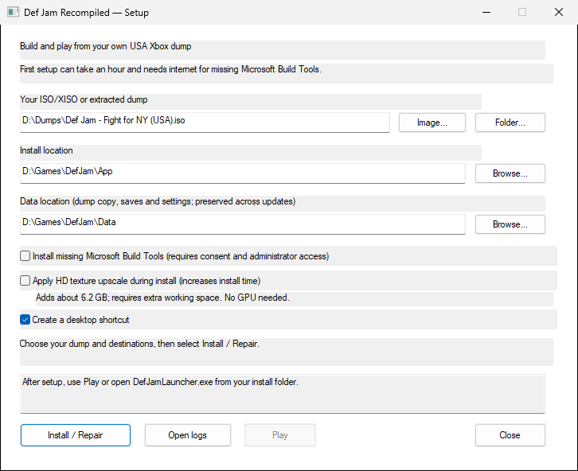
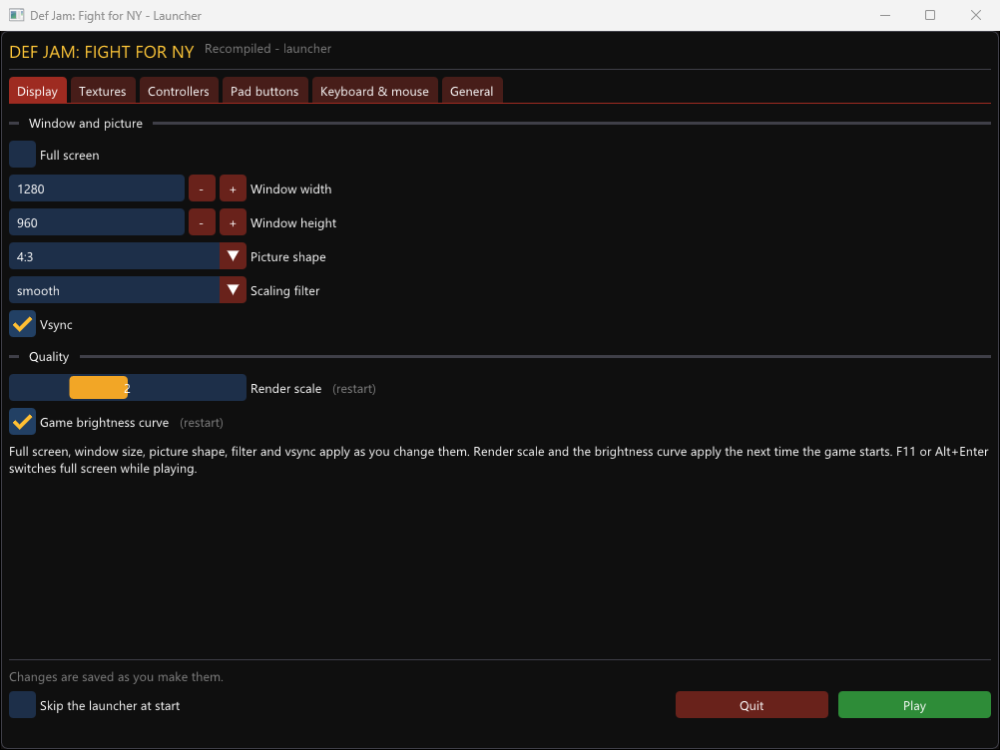

# Def Jam: Fight for NY — Recompiled

[](https://github.com/vyanhursky/DefJamFFNY-recomp/actions/workflows/ci.yml)
[](https://github.com/vyanhursky/DefJamFFNY-recomp/releases)
[](LICENSE)

A native PC port of **Def Jam: Fight for NY**, built from the original Xbox
version with [xboxrecomp](https://github.com/sp00nznet/xboxrecomp). The Xbox
executable is translated into C and compiled ahead of time. The game's own
gameplay, menus and cutscenes run on an Xbox compatibility runtime, drawn through
Direct3D 11 on Windows and Vulkan on macOS, with sound and controllers supplied
by the host.

**The Windows build is playable.** Menus, Story mode and fights run at 60 fps
with sound. It is still an early release: see [known issues](docs/known-issues.md).

You need your **own Xbox game dump**, and the game is built on your machine.
This repository holds the port's code, tools and documentation. It contains no
game assets, disc images, translated game code or game executable.

[Install and build](docs/build-and-play.md) · [Documentation](docs/README.md) ·
[Known issues](docs/known-issues.md) · [Contributing](CONTRIBUTING.md) ·
[Releases](https://github.com/vyanhursky/DefJamFFNY-recomp/releases)

## Features

- **Native on Windows and macOS.** Direct3D 11 on Windows x64, Vulkan on Apple
  Silicon Macs. Linux is in progress: the runtime builds, the game does not run
  there yet.
- **Controllers, keyboard and mouse.** Xbox (XInput), DualSense, Switch Pro and
  most other gamepads, with rumble, hot-plug and remapping. The keyboard and
  mouse play as a player of their own. Up to four players locally.
- **Higher resolution.** Renders at up to 4× the console's resolution, in a
  resizable window or borderless full screen.
- **Optional HD textures.** 4× texture packs generated on your machine from
  your own dump (Windows).
- **An installer that builds the game for you.** Point the Windows setup wizard
  at your dump; it checks it, then translates and compiles the game locally.
- **Launcher and in-game settings.** A start-up window and an overlay (F1) for
  display, texture, controller and key settings, usable with mouse, keyboard or
  pad (Windows).
- **Your saves stay local.** Profiles live in your data folder and survive
  updates and repairs.

## Gameplay


Gameplay captured by the maintainer. The GIF is a short, silent preview.

## Status

| Area | Status |
|---|---|
| Windows x64 | Playable; tested on Windows 11 |
| macOS (Apple Silicon) | Playable through Vulkan since v0.5.0, without the launcher, overlay or HD textures; see [Build on macOS and Linux](docs/build-macos-linux.md) |
| Linux | The runtime and its test fixtures build in CI; the game is not yet built or run there |
| Steam Deck / Proton | Planned; not yet tested |
| Menus and fights | Menus, match setup, fights and the return to the menus work |
| Story | Intro and cutscenes, character creator, crib and gym work; a full playthrough has not been verified |
| Graphics | Direct3D 11 at up to 4× the console resolution; 4:3 picture (true 16:9 is planned) |
| HD textures | Optional 4× texture packs, generated locally from your own dump; on Windows and (since v0.6.1) macOS; see [HD textures](docs/hd-textures.md) |
| Audio | Music, speech and effects |
| Input | Gamepads (Xbox, DualSense, Switch Pro and most others), keyboard and mouse, rumble and remapping; see [Controllers, keyboard and mouse](docs/10-input.md) |
| Launcher and overlay | A start-up window and an in-game settings overlay (F1) on Windows; see [Launcher and overlay](docs/launcher-and-overlay.md) |
| Saves | Local profiles in your data folder |

## Install

Only the **USA Xbox version** matching the [dump manifest](config/dump-manifest.json)
is supported. PS2 and GameCube copies cannot be used.

### Windows: setup installer

Download `DefJamSetup-<version>-windows-x64.exe` from the
[latest release](https://github.com/vyanhursky/DefJamFFNY-recomp/releases/latest).
The installer contains no game. It takes your disc image or extracted dump,
checks it, then translates and compiles the game on your machine. It bundles
Python and the pinned build sources and can install Microsoft's C++ Build Tools
if they are missing. The installer is unsigned, so Windows may warn about it.



See [Windows setup](docs/setup-installer.md) for folders, shortcuts, HD texture
generation, silent mode, repair and removal.

### macOS: setup installer (Apple Silicon)

Download `DefJamSetup-<version>-macos-arm64.dmg` from the
[latest release](https://github.com/vyanhursky/DefJamFFNY-recomp/releases/latest)
and open `Def Jam Setup`. It has the same steps as the Windows wizard, needs no
Terminal, Homebrew or build tools of your own, and works without an internet
connection. It does need Apple's free **Xcode Command Line Tools**; if they are
missing, setup stops and links Apple's
[installation instructions](https://developer.apple.com/documentation/xcode/installing-the-command-line-tools/).
The setup is unsigned, so macOS blocks it the first time: choose **Done**, then
open System Settings, Privacy & Security, scroll to Security and choose **Open
Anyway**. See [macOS setup](docs/setup-installer.md#macos-setup-apple-silicon) for
folders, shortcuts, silent mode and removal.

### Windows: build from source

You need Git, Python 3.12 or newer, Visual Studio Build Tools with the C++
workload, and a Direct3D 11 GPU.

```powershell
git clone --recursive https://github.com/vyanhursky/DefJamFFNY-recomp.git
cd DefJamFFNY-recomp
```

Follow [Build and play](docs/build-and-play.md) to choose a data folder and
extract and verify your disc. Then:

```powershell
.\scripts\analyze.ps1
.\scripts\recomp.ps1
.\scripts\build.ps1 -Preset win-x64-release
.\scripts\run.ps1 -Preset win-x64-release
```

Use a recursive clone: GitHub's source ZIP leaves out the toolkit submodule.

### macOS and Linux: build from source

On a Mac, the setup above is the easy way. To build by hand, or on Linux, follow
[Build on macOS and Linux](docs/build-macos-linux.md). It lists what works there
and what does not yet.

## Playing

The game opens a launcher window with display, controller and key settings and
a Play button. The same settings are available in the game with F1, and in
`settings.ini` in your data folder.



- [Launcher and overlay](docs/launcher-and-overlay.md)
- [Controllers, keyboard and mouse](docs/10-input.md)
- [settings.ini and keybinds](docs/settings-reference.md)
- [HD textures](docs/hd-textures.md)

## Testing

Tests that need no game data, which is also what GitHub CI runs:

```powershell
python -m pip install pytest pyxbe capstone Pillow numpy
python -m pytest -q tests/unit
python scripts/check-source-tree.py
```

Tests that play the game need a local build made from your own dump:

| Command | Time | Covers |
|---|---|---|
| `python scripts/regress.py --quick` | about 10 minutes | unit tests, three reference frames and one fight |
| `python scripts/regress.py` | about an hour | adds four-fighter and two-pad matches, combat results, a replay check, Story routes and a boot soak |

Do not run two game tests at once: they share the save area and the window.
The [gameplay test harness](docs/09-testing-harness.md) guide explains each
check and its report, and [CONTRIBUTING.md](CONTRIBUTING.md#testing) says which
tests a change needs.

## Reporting problems

Open an [issue](https://github.com/vyanhursky/DefJamFFNY-recomp/issues/new/choose)
and pick the form that fits. Check [known issues](docs/known-issues.md) first.
A useful report has:

- the release version or commit, and whether you used the installer or a source build;
- your operating system, CPU, GPU and controller;
- the steps that lead to the problem, and what you expected instead;
- the relevant lines of the log (`logs/run-*.log.err` for a source build, or the
  installer log under `%LOCALAPPDATA%\DefJamSetup\logs`). Remove personal paths first.

Never attach game data: no disc images, game files, translated game code, saves,
memory dumps or audio recordings. A screenshot of the problem is fine.

## Contributing

Bug fixes, platform work and documentation are welcome. [CONTRIBUTING.md](CONTRIBUTING.md)
covers the development setup, where each kind of change belongs, the tests to
run and what a pull request needs. Changes to the generic runtime or translator
go to the [toolkit fork](https://github.com/vyanhursky/xboxrecomp), and from
there upstream where they help other games.

## Roadmap

Released so far: display settings and a settings file, gamepad and keyboard
input, the launcher and overlay, a native macOS build, the Windows installer and
optional HD textures. Still planned:

- true 16:9 widescreen in fights;
- the launcher, overlay and HD textures on macOS;
- Steam Deck through Proton, then a native Linux game build;
- deeper gameplay decompilation, as a stretch goal.

See the [roadmap](docs/01-plan-review.md#corrected-roadmap-milestones-with-exit-criteria),
the [PC features plan](docs/07-m6-plan.md) and the [improvement backlog](docs/04-improvement-backlog.md).
The [release notes](docs/releases) record what each version changed.

## Credits and licensing

Maintained by **vyanhursky**, with development assistance from Claude Code
and Codex. The port builds on **sp00nz's xboxrecomp** and on work from the Xbox
emulation community. xemu provides hardware references and attributed components
in the toolkit. [Burnout 3](https://github.com/sp00nznet/burnout3) and
[Mercenaries Recompiled](https://github.com/KraftMacAndChee/Mercenaries-Recompiled)
are related projects that helped shape the documentation.

This repository's code is [MIT licensed](LICENSE). Toolkit components keep their
own licenses, including LGPL-2.1-or-later components; see the toolkit's
[NOTICE](https://github.com/vyanhursky/xboxrecomp/blob/4bff2573127c5499ad795d58ddd90159240520bd/NOTICE)
and [license texts](https://github.com/vyanhursky/xboxrecomp/tree/4bff2573127c5499ad795d58ddd90159240520bd/LICENSES).
The license grants no rights to the game or its assets.

This is an unofficial fan project, not affiliated with Electronic Arts, AKI or
Def Jam. Def Jam: Fight for NY and its assets belong to their respective owners.
